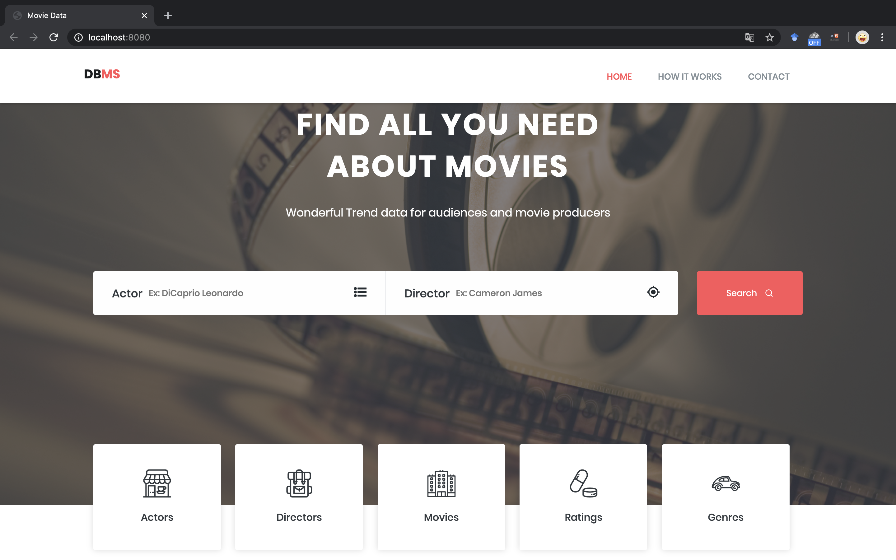
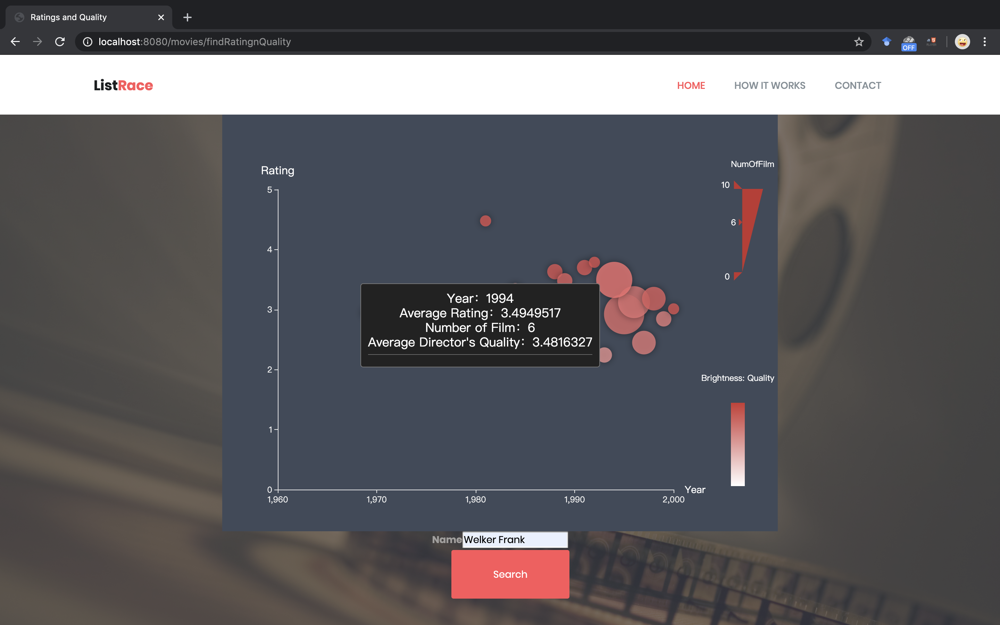
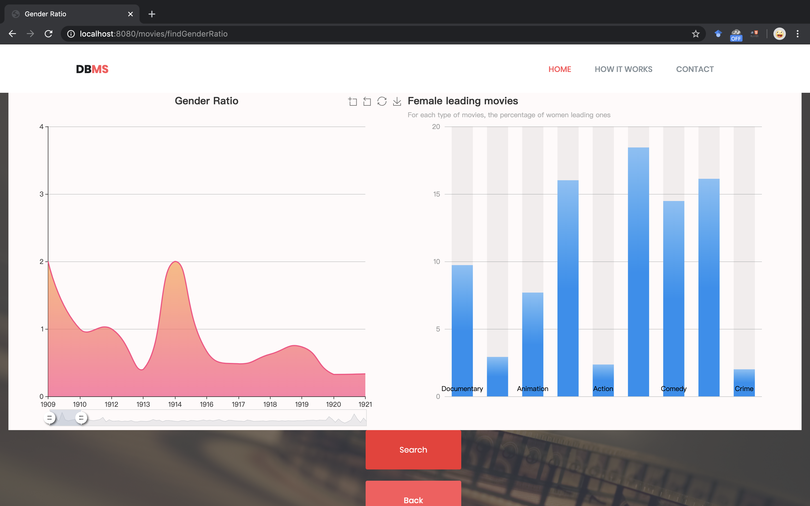

# IMDb Data Analysis

**UFID 2144-2855**  
*Keyuan Lu*  
keyuan.lu@ufl.edu

## Introduction
This is a web application is based on a database of movies data which mainly contains tables of movie, actors, directors and ratings from users.  

Here is the structure of the tables:

## Components
SSM, Oracle Database, JavaScript

## ScreenShots of the application

